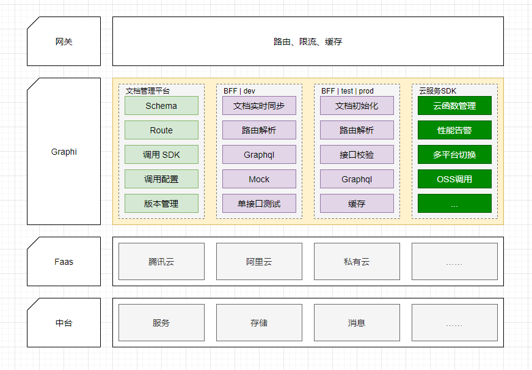

# Graphi
Graphi是一个Faas接口管理平台，包含接口文档，接口网关两个部分。接口文档用来定义数据结构（Schema）和接口以及接口开发中的测试，也可以用作传统项目的接口文档管理。接口网关实现文档和接口的转换，通过graphql实现数据mock（dev模式下），数据校验，过滤等功能。

## Usage
接口文档使用参见[https://github.com/ihparg/graphi-core]

网关使用参见[https://github.com/ihparg/graphi-api]

## Feature
目前已完成功能
- Schema 管理，复用数据结构和生成model代码
- Route 管理
- CodeGenerator
  - node sequelize 代码生成
- 开发中接口Mock（需要graphi-api配合）
- 腾讯云Faas接口预览调用（需要graphi-api配合）
- 阿里云Faas接口预览调用（需要graphi-api配合）
- 项目接口版本管理

## Warning
本项目仍处于开发和探索中，接口文档部分可以用于生产，网关部分只建议学习和小型项目试用。